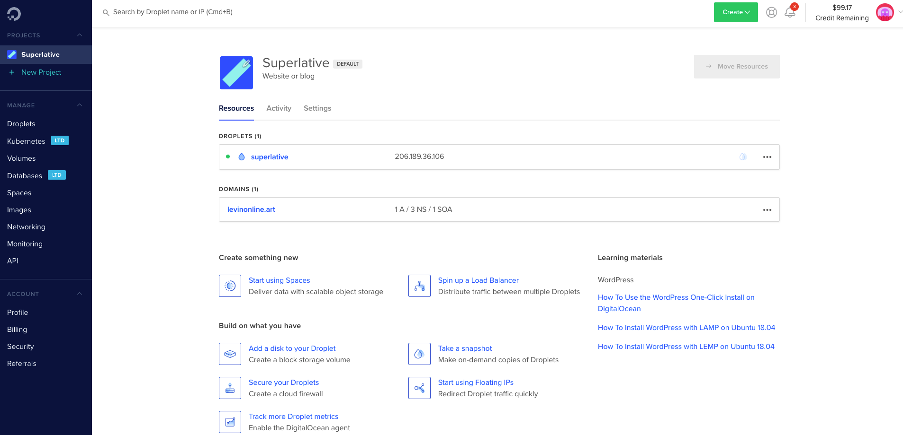
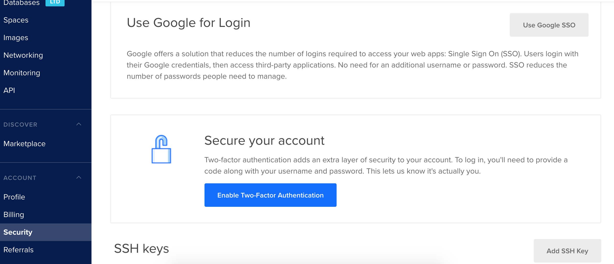
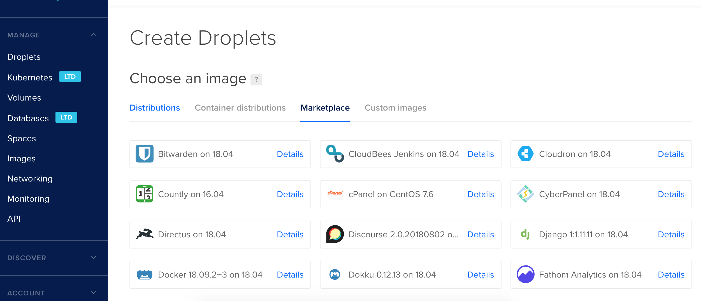
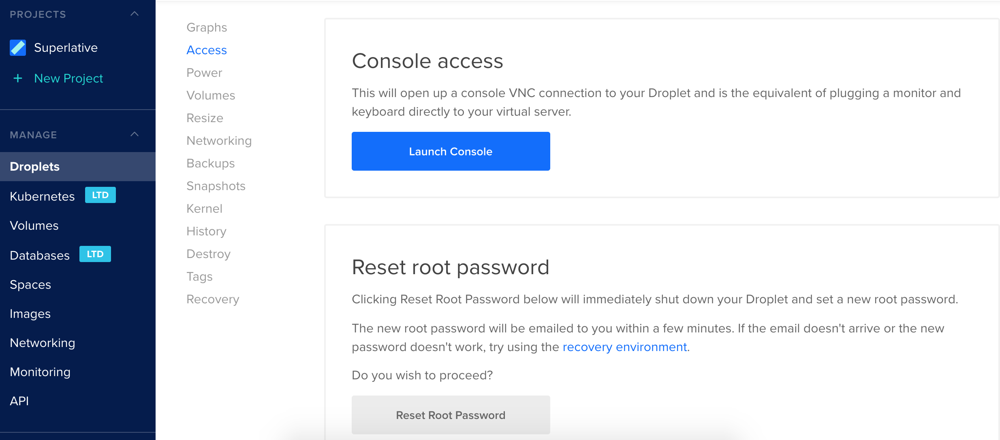
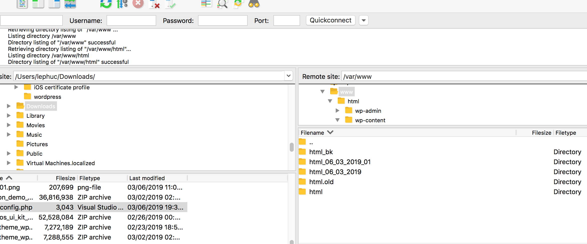
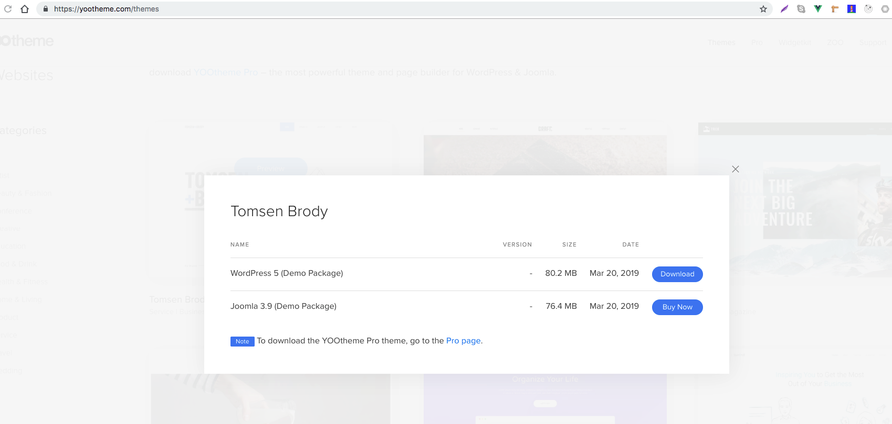
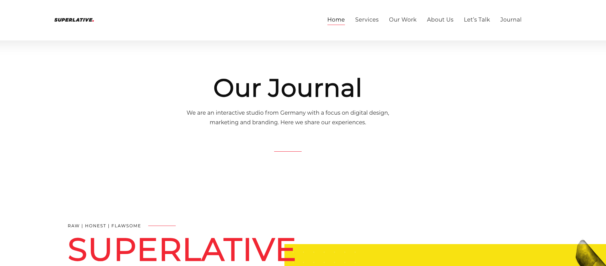
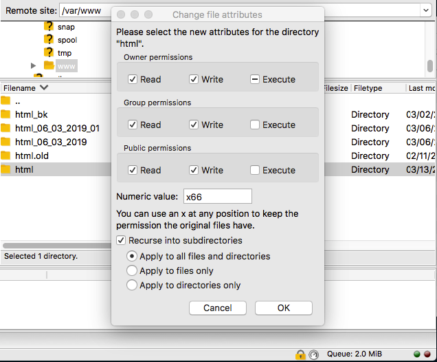

It is my first post on my new blog! How exciting!

Today, I would like to talk about my experience to build a WordPress website with one of the themes from YooTheme and hosting on DigitalOcean. 

Firstly, I have to admit this is my first time to seriously working on Word Press even I have worked as Front End Developer for more than four years. A little embarrassing :(

## Digital Ocean

> Our optimized configuration process saves your team time when running and scaling distributed applications, 
> AI & machine learning workloads, hosted services, client websites, or CI/CD environments.

I immediately fall in love with Digital Ocean about how easy it is, UI/UX clear and colorful and good thing, you will have 100$ credit for the first time registration. You can do your experimental with excellent dashboard and a lots one-click setup different environments.

Before we start to use Digital Ocean, I highly recommend you set up the security with Google SSO or SSH key to connect the server easily from your laptop because we are going to use Word Press so you should set up SSH key to transfer files to a server.

## Droplets

Droplets in Digital Ocean is a similar image of Docker but more general and with many options and markets. We will choose the market WordPress on 18.04

Create the projects

Connecting the server

https://www.digitalocean.com/docs/marketplace/wordpress/

You maybe will face the permission denied when trying to connect to the server with root user. So what we need to that reset root password on the project is using the droplets. Unfornaturely, you have to enter a new password manually.

## File Zilla

I am using FileZilla to connect the server by SFTP. You can use another tool like Cyberduck. You can refer 

https://askubuntu.com/questions/697439/how-to-connect-to-sftp-in-filezilla-using-private-key

https://www.digitalocean.com/community/tutorials/how-to-use-sftp-to-securely-transfer-files-with-a-remote-server#how-to-connect-with-sftp

After connecting to the server you go to folder link www/html

take a back up the entire html folder and replace it with Demo theme folder we download from https://yootheme.com/

## Here we go http://206.189.36.106/ :)

You might face the issue cannot create the folder because of permission. To solve it, we allow writing.

